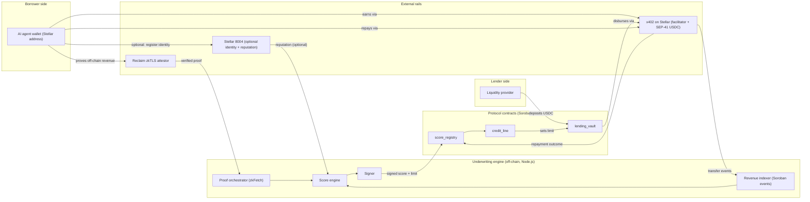

# TrustLine

**An on-chain, credit-based lending protocol for AI agents on Stellar. Borrowing power is underwritten by verified revenue, not wallet history, and every credit decision settles autonomously in USDC over x402.**

> The score is not a credibility badge. It is a real lending decision, sized against income an agent can prove.

**Status:** Testnet MVP for the Stellar Build Station. The two load-bearing technical risks have been validated on Stellar testnet (see [Validation status](#validation-status)). The chain is Stellar, the contracts are Soroban, and settlement is x402.

---

## Table of contents

- [One-paragraph summary](#one-paragraph-summary)
- [What changed from the EVM version](#what-changed-from-the-evm-version)
- [Problem statement](#problem-statement)
- [Solution](#solution)
- [Key features](#key-features)
- [Why Stellar, and why now](#why-stellar-and-why-now)
- [Validation status](#validation-status)
- [Architecture](#architecture)
- [User flow](#user-flow)
- [Tech stack](#tech-stack)
- [Project structure](#project-structure)
- [Identity, decoupled](#identity-decoupled)
- [Competitive landscape](#competitive-landscape)
- [Why TrustLine wins](#why-trustline-wins)
- [Risk model and economics](#risk-model-and-economics)
- [Roadmap](#roadmap)
- [Getting started](#getting-started)
- [License](#license)
- [Disclaimer](#disclaimer)

---

## One-paragraph summary

AI agents now hold wallets, earn income, and transact autonomously, but none of that income is usable as credit. TrustLine turns an agent's verifiable, trailing revenue into an uncollateralized credit line. An agent registers, gets underwritten against provable income, borrows, and repays, all settling in USDC over x402 with no human in the loop. Borrowing power comes from two verifiable signals today (on-chain x402 earnings indexed from Soroban events, and off-chain revenue attested by Reclaim zkTLS) plus a third on the roadmap (a zkML proof of a trading agent's strategy track record). Every credit line is its own isolated vault, so one agent's default never touches another lender's deposit. The defensible IP is the underwriting and the Sybil model, not the lending shell.

## What changed from the EVM version

The original TrustLine spec targeted Base, Solidity, and ERC-8004. This build runs on Stellar. The product thesis is unchanged. What changed is the substrate, and in several places Stellar is a better fit rather than a tolerable port. The table below is the full diff.

| Layer | EVM original (Base) | Stellar build | Why it changed |
|---|---|---|---|
| Contracts | Foundry, Solidity, Base Sepolia | Soroban, Rust, WASM, Stellar testnet | Soroban is Rust and WASM. Full rewrite of the three core contracts, no architectural change. |
| Settlement | x402 on Base | x402 on Stellar via `@x402/stellar`, SEP-41 USDC, auth-entry signing, OZ Channels or Coinbase facilitator | x402 is native on Stellar with fees near $0.00001 and first-class USDC. Better for a product whose signal is indexing micro-revenue. |
| Identity | Anchored to ERC-8004 as the portable standard | Decoupled. Scores key off a stable Stellar address. Optional Stellar 8004 adapter for reputation and discovery | ERC-8004 is a real mainnet standard. Stellar 8004 is a single testnet hackathon project with several competitors. We do not bet composability on an unsettled dependency. |
| Off-chain proof | Reclaim or Primus, generic | Reclaim with a deployed Soroban verifier, proofs generated via zkFetch with private headers | Reclaim ships an official Soroban integration and a live testnet verifier. This is now validated, not assumed. |
| zkML proof (v2) | Generic, unspecified verifier | Soroban native BLS12-381 host functions (CAP-0059) for native Groth16 verification | A pairing check that costs tens of millions of WASM instructions elsewhere is a single host call here, which makes the hardest stretch goal more realistic on Stellar than on EVM. |
| Score-engine decentralization (v2) | EigenLayer AVS, multiple operators | Stellar-native signer committee using multisig thresholds, with on-chain slashing logic in Soroban | EigenLayer does not exist on Stellar. The decentralization story is rebuilt natively. |
| Frontend wallet layer | wagmi and viem | Stellar Wallets Kit and Freighter | EVM wallet libraries do not apply. Next.js itself is unchanged. |
| Portability claim | "Anchored to ERC-8004 identity, readable by other lenders" | "The ScoreRegistry contract is the portable artifact, keyed to a stable address, readable by any lender" | The real portable thing was always the score contract, not the identity registry. On Stellar this claim is now more honest, not less. |
| Competitive frame | Helixa, Credifi, Floe, Crediflex (EVM world) | Blend as the Soroban lending reference point. Identity registries are a crowded Stellar space we deliberately do not enter | The competitive set on Stellar is different and thinner. We consume identity as a dependency and differentiate on underwriting. |
| Validation | Pure design document | Two of three load-bearing risks measured and passing on testnet | The original was a design spec. This build carries empirical de-risking. |

Two things did not change and are worth stating plainly. The isolated-vault risk model is identical, because that lesson is chain-agnostic. And the regulatory posture is identical, because lending is lending regardless of the chain or the "agent" framing.

## Problem statement

AI agents now hold their own wallets, earn their own income, and transact with real autonomy. Agentic payment volume over x402 and the Machine Payments Protocol is real and growing on Stellar mainnet. But that income is not usable as credit.

An agent that needs working capital today has two bad options:

1. **Over-collateralize.** Lock up more value than it borrows, which defeats the purpose of giving an agent financial agency.
2. **Borrow against a weak signal.** Every credit signal in common use (wallet age, token diversity, NFT holdings, general reputation) measures whether an agent is real and consistent, not whether it can repay. A long-running, reputable agent can have zero revenue. A brand-new agent from a reliable operator can have strong, provable cash flow from day one.

Nobody turns an agent's actual, provable income into usable, uncollateralized capital with the risk properly isolated so one bad agent does not sink everyone else's deposits.

## Solution

TrustLine is one protocol. It lends to AI agents, sized against verified revenue, instead of requiring collateral or trusting a reputation score that was never built to predict repayment.

From the outside, an agent registers, gets underwritten, borrows, and repays. Under the hood, borrowing power comes from verifiable revenue signals computed as part of the same lending flow:

1. **On-chain x402 earnings.** Already on the ledger as Soroban token transfers, so no proof system is needed, just an indexer reading `transfer` events.
2. **Off-chain revenue, zkTLS-attested.** Stripe payouts, exchange balances, or marketplace earnings, proven via Reclaim without exposing the underlying account or key.
3. **Strategy performance, zkML-attested (v2).** A cryptographic proof that a trading agent's claimed track record came from the model it says it ran.

Every credit line is isolated to one agent, never a shared pool. Every disbursement and repayment settles autonomously over x402 in USDC. No human approves the loan, and no agent's default touches anyone else's deposit.

## Key features

- **Revenue-based underwriting.** Credit limits are a multiple of verified trailing income, not a proxy for it.
- **Isolated risk per agent.** Every credit line is its own vault. No pooled, socialized losses.
- **x402-native settlement.** Disbursement, repayment, and interest all move autonomously in USDC at near-zero cost.
- **Portable score.** The ScoreRegistry contract is keyed to a stable Stellar address and is readable on-chain by any lender, not locked into TrustLine.
- **Composable by design.** The underwriting result lives on-chain, so other lenders can read an agent's TrustLine standing even if they never use TrustLine's own credit lines.

## Why Stellar, and why now

- **x402 and the agentic payment stack are native and live on Stellar.** Settlement uses SEP-41 USDC over Soroban authorization entries, with facilitators sponsoring network fees. Fees near $0.00001 make revenue indexing and micro-settlement cheap in a way EVM L1s cannot match.
- **The zkTLS verifier already exists on Soroban.** Reclaim's deployed testnet verifier removes the single hardest non-stretch dependency from "research project" to "integration."
- **Soroban has native BLS12-381 host functions.** This is the substrate for native Groth16 verification, which is exactly what the v2 zkML strategy proof needs, and it is cheaper here than anywhere else.
- **Pooled, uncollateralized lending has a documented history of blowing up** when one borrower's risk was not actually isolated. TrustLine is designed around that lesson from day one, not retrofitted after a default.

## Validation status

The original spec was a design document. Before committing the build to Stellar, the two risks that could have sunk it were isolated into spikes on testnet. Both load-bearing unknowns are now answered.

| Gate | Result | What it proved |
|---|---|---|
| Gate 1: x402 payer identity | PASS | A settled x402 payment records the SAC `transfer.from` as the agent address, not the facilitator. The facilitator appears only in a separate transaction-level `fee` event. Distinct payers are therefore countable on-chain. |
| Gate 2A: Reclaim verifier leg | PASS | A fresh zkTLS proof verifies against the deployed Soroban verifier contract with a SUCCESS transaction. |
| Gate 2B: private revenue proof | PASS | A private API response (a Stripe balance) was proven on Soroban via Reclaim, with the API key held in private options and confirmed absent from the proof object. The mechanism works without exposing the account or key. |

**What the gates did not prove, stated honestly:**

- Gate 1 proved distinct payers are countable, not that distinct payers are independent counterparties. An operator looping their own wallets still produces valid `transfer.from` values. Counterparty independence is the real open problem and is treated as the core research bet, not a solved feature.
- Gate 2B proved the proof mechanism on a point-in-time balance. The actual underwriting signal is trailing revenue over a window, which lives in paginated list endpoints. Because zkFetch proves one HTTP response, trailing-revenue aggregation across pages is a separate design item (see [Risk model and economics](#risk-model-and-economics)).

## Architecture

TrustLine has two layers that only function together. An off-chain underwriting engine computes borrowing power. On-chain Soroban contracts hold funds and enforce what it decides. This is one protocol with a hybrid execution model, the same way most lending markets lean on an oracle without being two products.



**MVP-stage honesty:** the underwriting engine runs as a single trusted signer for the build, not a decentralized committee. That is a deliberate scope cut documented in [Roadmap](#roadmap), not an oversight.

## User flow

```mermaid
sequenceDiagram
    participant Agent
    participant Oracle as Underwriting engine
    participant Registry as score_registry
    participant Vault as lending_vault
    participant Lender

    Agent->>Registry: Register (stable Stellar address; optional Stellar 8004 link)
    Agent->>Oracle: Submit x402 history + Reclaim zkTLS revenue proof
    Oracle->>Oracle: Index Soroban transfer events, verify proof, compute coverage score
    Oracle->>Registry: Publish signed score + credit limit
    Lender->>Vault: Deposit USDC into the agent's isolated vault
    Agent->>Vault: Request credit line
    Vault->>Registry: Read score + limit
    Vault->>Agent: Disburse loan via x402
    Agent->>Vault: Repay principal + interest via x402
    Vault->>Registry: Report repayment outcome
    Registry->>Registry: Update score tier
```

## Tech stack

| Layer | Choice | Notes |
|---|---|---|
| Contracts | Soroban (Rust, WASM), `stellar` CLI | Stellar testnet for the build. `cargo test` plus Soroban test host. |
| Settlement | x402 on Stellar, `@x402/stellar` | SEP-41 USDC, auth-entry signing, facilitator sponsors fees. Direct SAC transfer as a fallback. |
| Off-chain proofs | Reclaim, `@reclaimprotocol/zk-fetch` + `@reclaimprotocol/js-sdk` | Deployed Soroban verifier. Private headers via zkFetch keep keys out of the proof. |
| Identity | Stable Stellar address by default. Optional Stellar 8004 adapter | Reputation and discovery only. Not load-bearing. See [Identity, decoupled](#identity-decoupled). |
| Backend | Node.js (Fastify or Express), `@stellar/stellar-sdk` | Revenue indexing via `getEvents`, proof orchestration, scoring, signing, REST for the frontend. |
| Frontend | Next.js (App Router), Stellar Wallets Kit, Freighter | Separate borrower and lender routes. |
| zkML (v2) | Soroban BLS12-381 host functions, Groth16 | Native pairing checks. Stretch goal, not a blocker. |

## Project structure

```
trustline/
├── contracts/                         # Soroban workspace (Rust)
│   ├── Cargo.toml                     # workspace manifest
│   ├── score_registry/
│   │   └── src/lib.rs                 # signed scores + tiers, keyed by Stellar address
│   ├── credit_line/
│   │   └── src/lib.rs                 # per-agent limit + interest terms
│   ├── lending_vault/
│   │   └── src/lib.rs                 # isolated vault, disburse/repay via x402
│   ├── adapters/
│   │   ├── x402_settlement/           # disbursement + repayment glue
│   │   └── stellar8004_identity/      # optional identity/reputation adapter
│   ├── libraries/
│   │   └── revenue_math/              # coverage ratio, tier banding
│   └── tests/
│       ├── score_registry_test.rs
│       ├── lending_vault_test.rs
│       └── integration/
│
├── backend/                           # Node.js underwriting engine (off-chain layer)
│   ├── src/
│   │   ├── indexer/                   # Soroban getEvents: x402 transfer receipts
│   │   ├── zktls/                     # zkFetch proof request + on-chain verify
│   │   ├── scoring/                   # composite revenue-coverage score
│   │   ├── signer/                    # signs scores for on-chain submission
│   │   └── api/                       # REST endpoints for the frontend
│   ├── package.json
│   └── tsconfig.json
│
├── frontend/                          # Next.js app
│   ├── app/
│   │   ├── borrower/                  # agent / operator dashboard
│   │   ├── lender/                    # liquidity provider dashboard
│   │   └── api/                       # route handlers
│   ├── components/
│   ├── lib/
│   │   └── stellar.ts                 # Wallets Kit + Freighter setup
│   └── package.json
│
├── spikes/                            # de-risking spikes (testnet, validated)
│   ├── spike1-x402-payer/             # Gate 1: payer identity
│   └── spike2-reclaim-revenue/        # Gates 2A/2B: zkTLS revenue proof
│
├── docs/
│   ├── architecture.md
│   ├── scoring-methodology.md
│   └── sybil-model.md                 # counterparty independence design
│
└── README.md
```

## Identity, decoupled

The EVM spec anchored everything to ERC-8004. On Stellar that anchor does not exist as a settled standard. Stellar 8004 borrows the name but is a single testnet project that shared its hackathon with several competing registries, so depending on it the way the original depended on ERC-8004 would bet composability on an unmaintained dependency.

The fix splits identity into three jobs, only one of which is load-bearing:

- **Stable identifier (load-bearing).** The agent's Stellar address is already canonical. The ScoreRegistry keys scores directly to it, so core lending logic has zero registry dependency.
- **Reputation and validation (enrichment).** Useful for richer underwriting, but optional.
- **Discovery and the agent card (enrichment).** Capabilities, endpoints, advertised x402 and MPP support. Nice to have, not required.

Identity sits behind a thin `IIdentityRegistry` interface. The default implementation validates the address. An optional `stellar8004_identity` adapter plugs in reputation and discovery when wanted, and dropping it is deleting a file. The portable artifact was never the identity registry. It is the ScoreRegistry contract, address-keyed and readable by any lender.

## Competitive landscape

The original landscape was entirely EVM-world. On Stellar the field is different and thinner. The point is that TrustLine deliberately does not compete on identity, which is the crowded part. It consumes identity and differentiates on the credit decision.

| Project / category | What it does | Where TrustLine differs |
|---|---|---|
| Stellar 8004 and peer agent registries | Identity, reputation, discovery for agents | Answers "is this agent real." TrustLine answers "can it repay," and lends against the answer. We consume a registry, we do not build one. |
| Blend (Soroban lending) | Pooled lending markets on Stellar | Pooled and collateral-driven. TrustLine is revenue-underwritten and isolated per agent, no socialized losses. Blend is the reference point, not a head-to-head. |
| Generic zkTLS credit scorers | Off-chain financial signals into a score | Built for humans, general purpose, not agent-native or revenue-sized by default. |
| Revenue-backed lending (human-originated) | Underwrites against real cash flow | Leans on human originators and institutional deal structuring an autonomous agent does not have. |

## Why TrustLine wins

- **Timing.** x402, the Soroban Reclaim verifier, and native BLS host functions all matured recently. This was not cleanly buildable a year ago and is not yet a commodity.
- **Native, not ported.** Every dependency is a Stellar-native primitive, validated on testnet, not a bridged EVM approximation. That reads as native to judges and to other builders.
- **Avoids the model that has failed twice.** Agent tokenization has a rough record even for strong teams. TrustLine is a fee-and-interest business backed by real cash flow, not a token-and-speculate model.
- **Built on a stable identifier, not a silo.** Anchoring to a Stellar address rather than a proprietary registry means any lender can read an agent's standing without touching TrustLine.
- **A genuinely new signal.** The v2 zkML strategy-performance proof has no precedent in this space, and Soroban's native pairing checks make it more feasible here than anywhere else.

## Risk model and economics

These were the sharpest open questions in the design. They are answered explicitly rather than left implicit, and the spike results sharpened two of them.

**Counterparty independence is the core bet, and it is unsolved.** Gate 1 proved distinct payers are countable on-chain, because `transfer.from` is the agent and not the facilitator. It did not prove those payers are independent people. An operator paying their own agent from multiple wallets manufactures fake x402 revenue. The MVP mitigation: revenue counts only from a minimum number of independently-identified counterparties, with zkTLS-proved off-chain revenue weighted more heavily, since faking a real Stripe or exchange account is a higher bar than looping a wallet. Robust anti-Sybil heuristics are the real research item, documented in `docs/sybil-model.md`. Two facilitator-side addresses (the submitter and the fee payer) are kept on an explicit exclude list so they can never be miscounted as payers.

**Trailing revenue, not point-in-time balance.** Gate 2B proved a balance read. The signal that actually sizes credit is trailing revenue over a window, which lives in paginated list endpoints. Because zkFetch proves a single HTTP response, trailing-revenue aggregation across pages cannot be proven atomically. The MVP approach: prove the response body per page and sum in the engine off the attested bodies, with full trustless aggregation as a v2 item. This shapes the scoring engine, so it is decided up front rather than discovered later.

**How a lender is protected.** Isolating risk per agent stops one default from touching another lender's deposit. It does not eliminate risk for the lender exposed to that agent. For the MVP this is intentional and transparent: a lender chooses which agent's credit line to fund, sees that agent's underwriting history before depositing, and accepts agent-specific default risk for a higher yield than a pooled market would pay. A protocol-level reserve fund, capitalized from origination fees, is a natural v2 addition for lenders who prefer diversification over picking agents.

**Interest rate model.** MVP default is a fixed APR per underwriting tier, set when a lender funds a specific agent's credit line, rather than a pooled utilization curve. Utilization curves matter when liquidity is shared across many borrowers, which does not apply to isolated single-agent vaults. Rate bands per tier are a parameter to tune against real test data.

**No speculative token.** TrustLine has no governance or rewards token by design. The neighboring category, agent tokenization, has a rough record specifically because token speculation became the product instead of the underlying credit business. TrustLine's revenue is interest spread and origination fees on real loans.

## Roadmap

**Build-station MVP**
- Agent registration keyed to a stable Stellar address (optional Stellar 8004 link)
- x402 on-chain revenue indexing from Soroban `transfer` events
- One Reclaim zkTLS off-chain revenue proof type, verified on Soroban
- Composite revenue-coverage score, single trusted signer
- Isolated lending vaults with score-tiered LTV
- x402 disbursement and repayment
- Borrower and lender dashboards

**Post-build (v2)**
- Trailing-revenue aggregation across paginated sources (per-page proofs summed in the engine, then trustless aggregation)
- A real counterparty-independence model beyond the minimum-counterparty heuristic
- zkML strategy-performance proof for trading agents, using Soroban BLS12-381 Groth16
- Decentralize the score engine into a Stellar-native signer committee with multisig thresholds and on-chain slashing
- Additional zkTLS revenue source types
- Protocol-level reserve fund for diversified lenders
- Audit, then mainnet

## Getting started

```bash
# contracts (Soroban / Rust)
cd contracts
stellar contract build
cargo test

# backend (underwriting engine)
cd backend
npm install
npm run dev

# frontend
cd frontend
npm install
npm run dev
```

Spikes that validate the two core risks live under `spikes/` and run on Stellar testnet. Environment variables and deployed contract addresses live in `.env.example` files in each package as they are finalized. Secrets stay in gitignored `.env` files.

## License

MIT, consistent with the open, standards-based positioning above. Easy to revisit before any public repo or mainnet deployment if the team wants different terms.

## Disclaimer

TrustLine extends credit and settles real value. Regardless of the "agent" framing, this is a lending product, and lending is regulated activity that varies by jurisdiction. Licensing, usury limits, and securities questions all apply once real capital moves. This README is a technical and product design document, not legal advice, and any mainnet deployment should go through proper legal review first.
