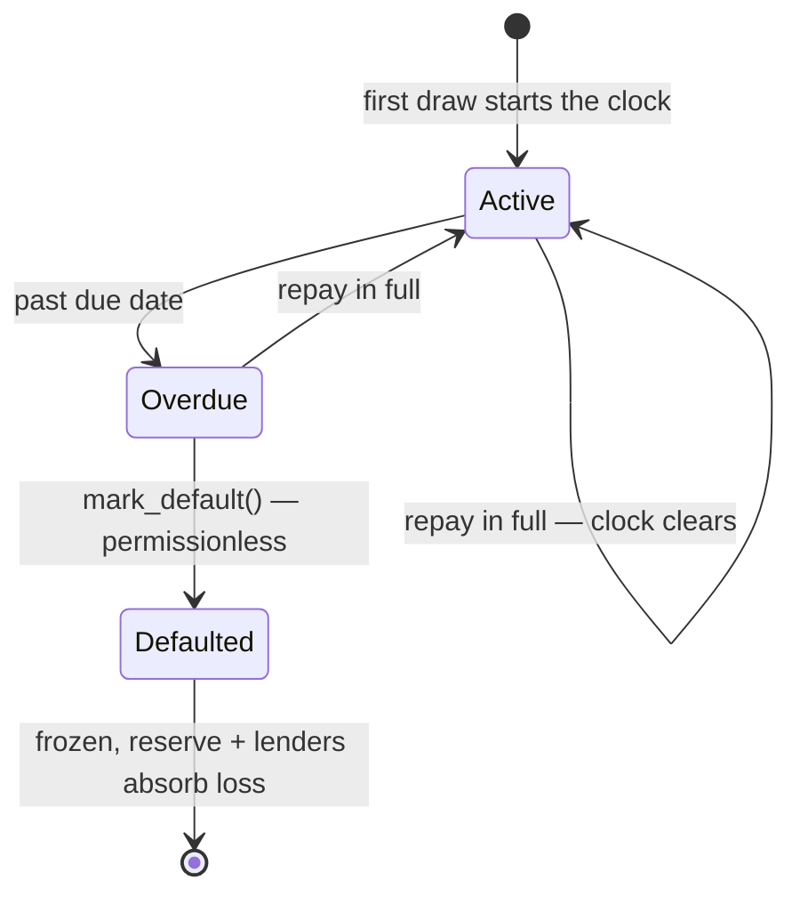

# TrustLine — How the Credit Engine Actually Works

_A ground-truth technical walkthrough of the whole underwriting pipeline: how
revenue is discovered, how the Sybil/independence tracker judges it, how the
score and credit line are computed, and how the on-chain lending contract
enforces it. Written from the code, not the pitch. Numbers are the current
testnet-calibrated values._

---

## 0. The one-sentence version

An AI agent's stable Stellar address earns USDC → TrustLine reads that revenue
off-chain, **discounts anything that looks self-dealt or fake** (the moat) →
turns the surviving "real, independent" revenue into a score and a credit tier
→ an on-chain vault lets the agent borrow against that tier, with defaults,
reserves and rate mechanics enforced by the contract.

Four layers, in order of how data flows:

1. **Revenue discovery** — what did this agent actually earn, on-chain?
2. **Independence engine (the Sybil tracker)** — how much of that is *real*?
3. **Scoring** — turn real revenue + history into a 0–850 score and a tier.
4. **On-chain credit engine** — the vault that actually lends, at the tier's terms.

---

## 1. Revenue discovery — and the honest answer about "x402"

### 1.1 How does it know a transaction was an x402 payment?

**It doesn't — and it doesn't need to.** This is the part everyone gets wrong,
so it's worth being blunt.

x402 is a *payment protocol*: a client requests a resource, gets an HTTP `402
Payment Required`, pays, and re-requests. But when that payment **settles on
Stellar, it lands as an ordinary USDC transfer** — byte-for-byte
indistinguishable on-chain from any other USDC transfer. There is no on-chain
"this was x402" flag, tag, or memo the engine could key off.

So the engine doesn't look for one. It treats **any USDC received by the
agent, from a distinct non-excluded counterparty, as revenue.** Two direct
consequences:

- **The system is x402-agnostic.** It would score revenue from any USDC
  inflow, whether it came through x402 or a plain wallet-to-wallet payment.
  "x402 revenue" in the pitch really means "USDC the agent earned from
  independent payers."
- **To avoid counting x402 *infrastructure* as a customer,** the engine keeps
  an exclude list (`X402_EXCLUDE_ADDRESSES`). x402 settlement transactions
  involve a **facilitator** (OZ Channels — the submitter) and a **fee
  sponsor**; those addresses show up in the transaction as the source /
  fee-payer, but they are never the genuine payer. The real payer is the
  `from` field of the USDC transfer itself (the customer's own wallet). The
  exclude list currently holds: the facilitator submitter, the fee sponsor, a
  testnet seeder wallet, and TrustLine's own vault contract addresses.

**Critical gotcha:** a *classic* Stellar USDC payment emits the **same SAC
transfer event** as a Soroban SAC contract transfer. So both forms are counted
identically — you cannot disguise or hide funding by choosing a classic
payment over a contract call. (This also matters for Sybil detection in §2.)

### 1.2 What a USDC transfer looks like to the engine

Every USDC movement — x402 or not, contract or classic — surfaces as a SAC
`transfer` event on the USDC token contract:

```
topics = [ "transfer", from, to, asset ]
data   = amount            // i128 stroops, 7 decimals (1 USDC = 10,000,000)
```

Revenue for an agent = the sum of `amount` over all events where:
`to == agent` **and** `from != agent` **and** `from` is not in the exclude list.
Each distinct `from` is one **payer** (counterparty).

### 1.3 Three sources of history (it uses whichever sees the most)

An agent's real payments can be recent or months old, so the engine reads from
three places and takes whichever reports the **most** revenue:

| Source | What it sees | Limit |
|---|---|---|
| **Soroban RPC `getEvents`** (`indexer/index.ts`) | live SAC transfer events | only ~24h of retention |
| **Postgres graph** (Track C, `indexer/persistent.ts`) | every transfer we've ingested | only from when *we* started indexing (~forward-only) |
| **Horizon deep history** (`indexer/horizon.ts`) | an account's *entire* operation history | slower; used as a fallback |

The Horizon path is the deep one: Horizon retains full account history
indefinitely and exposes the raw `invoke_host_function` call parameters for
every historical Soroban transfer (decodable with the same `scValToNative`
used everywhere), **plus** classic `payment` operations. It's only invoked
when the two fast sources both come up "thin" (< 0.5 USDC), so a normal
underwrite stays fast, but an agent whose real activity predates our window
isn't wrongly scored as having zero revenue.

---

## 2. The independence engine — the Sybil tracker (the moat)

This is the differentiated part. Reading inflows is a `SELECT`. The hard,
defensible question is: **is this revenue from genuine independent customers,
or is the operator paying themselves to manufacture a credit score?** If that
can be faked cheaply, the whole protocol is insolvent by construction.

Source of truth: `backend/src/scoring/independence.ts`, spec in
`docs/sybil-model.md`.

### 2.1 The core idea: effective independent revenue (`R_eff`)

Raw revenue is *not* what feeds the score. Each payer `i` gets an
**independence weight** `w_i ∈ [0,1]`, and the revenue is re-weighted:

```
w_i     = age_factor · diversity_factor · not_funded_factor · reciprocity_factor
R_eff   = concentration_factor · organicity_factor · Σ_i ( w_i · capped_i )
independence_score = R_eff / Σ raw_revenue     // shown as "% counted"
```

`R_eff` — not raw revenue — is what the scorer consumes. A payer scoring `w_i =
0` contributes nothing, no matter how much "revenue" it sent.

### 2.2 The four per-payer factors, in detail

**① Age factor** — *is this a real, established wallet or a throwaway?*
```
age_factor = clamp01( account_age_days / AGE_FULL_DAYS )    // AGE_FULL_DAYS = 2 (testnet)
```
- Account age comes from **Horizon's first-ever operation** for the wallet
  (true creation date, all-time — not limited to our window), OR the DB's
  first-seen record; it takes the **larger** (older) of the two.
- A wallet born this week counts less; a brand-new wallet counts ~0. Defeats
  the **fresh-wallet-farm** attack (spin up N new wallets to "pay" yourself).
- _Note: `AGE_FULL_DAYS` is 2 for testnet (the whole chain is only days old);
  a mainnet-scale value would be ~30. Overridable via `INDEP_AGE_FULL_DAYS`._

**② Diversity factor** — *does this payer do business with anyone else, or only
this agent?*
```
diversity_factor = clamp01( external_out_degree / DIVERSITY_FULL )   // DIVERSITY_FULL = 1 (testnet)
```
- `external_out_degree` = the number of **distinct other counterparties** the
  payer transacts with (both directions), **excluding the agent itself AND the
  agent's other payers**. That co-payer exclusion is deliberate — it stops a
  tight ring of wallets from looking "diverse" just because they trade among
  themselves.
- A wallet whose only counterparty is this agent is a **puppet** → factor ~0.
  Defeats the **self-pay** attack (aged wallets that only ever pay you).

**③ Not-funded factor (loop / circular-funding detection)** — *did the agent's
own money come back to it?*
```
not_funded_factor = fundedByAgent(payer, agent) ? 0 : 1
```
- This walks the payer's **USDC funding ancestry up to `MAX_HOPS = 3` hops
  backward** and asks: did this money originate from the agent? If
  `agent → … → payer → agent`, the payer is **circular** and its revenue is
  hard-zeroed. This is the signature attack (**A3**): fund some wallets, have
  them "pay" you, repeat.
- Computed two ways depending on data source: a k-hop reverse search over RPC
  `getEvents`, or (with the Postgres graph) a single **recursive SQL query** —
  same result, much faster.
- Known-hub addresses (faucets, facilitators) are **not** traversed through, so
  two honest agents funded by the same faucet don't look linked.

**④ Reciprocity factor (net-flow / collusion-ring defense)** — *does the
"vendor" pay the "customer" back?*
```
reciprocity_factor = clamp01( 1 − agent_paid_to_payer / payer_revenue )
```
- Real customers don't get paid *by* the seller. If the agent pays a payer
  roughly what that payer pays the agent, the net revenue is ~0. This kills a
  **mutual collusion ring** (**A7a**): K real operators cross-paying to inflate
  each other. `agent_paid_to_payer` is summed from actual `agent → payer`
  transfers.

### 2.3 The two whole-portfolio factors

**⑤ Concentration cap + HHI** — *is one "customer" secretly the whole business?*
```
capped_i           = min( revenue_i, MAX_PAYER_SHARE · Σ revenue )   // MAX_PAYER_SHARE = 0.40
HHI                = Σ ( capped_i / Σ capped )²
concentration_factor = 1 − clamp( (HHI − HHI_FLOOR) / (1 − HHI_FLOOR), 0, 1 )   // HHI_FLOOR = 0.15
```
- No single payer can contribute more than **40%** of counted revenue (the
  cap), and a portfolio dominated by 1–2 payers gets a low
  `concentration_factor` via a normalized Herfindahl index. A long tail of
  independent payers → HHI low → factor ≈ 1. Two payers → HHI high → factor →
  0. Defeats **concentration** (**A4**).

**⑥ Organicity factor (temporal)** — *is the cadence human/bursty or scripted?*
```
organicity_factor ∈ [ ORGANICITY_FLOOR, 1 ]     // ORGANICITY_FLOOR = 0.50
```
- Based on the coefficient of variation of inter-payment intervals: perfectly
  regular (scripted) cadence trends toward the floor; irregular/bursty (real)
  trends to 1. It's a **soft** signal — floored at 0.5 so it can flag but never
  hard-fail legitimate steady revenue. Flags **synthetic cadence** (**A5**).

### 2.4 The attack catalog — what's caught, what isn't (honest)

| # | Attack | Primary defense | Status |
|---|---|---|---|
| A1 | Self-pay (aged wallets that only pay you) | diversity → 0 | ✅ caught |
| A2 | Fresh-wallet farm | age → 0 | ✅ caught |
| A3 | Circular funding (you fund the payers) | k-hop loop detection → not_funded = 0 | ✅ caught |
| A4 | Concentration (1–2 payers = all revenue) | 40% cap + HHI penalty | ✅ heavily discounted |
| A5 | Synthetic/scripted cadence | organicity floor | ⚠️ flagged, soft |
| A6 | Off-chain self-charge (fake Stripe) | zkTLS signals (age, dispute rate) | ⚠️ partial |
| A7a | **Mutual** collusion ring (cross-pay) | reciprocity net-flow → 0 | ✅ caught |
| A7b | **Non-reciprocal** sophisticated ring | — | ❌ **remaining gap** |

A payer counts as a listed "independent counterparty" once `w_i ≥ 0.5`
(`INDEPENDENT_WEIGHT_THRESHOLD`). Verified against this whole catalog by
`npm run test:independence`, and against a **real on-chain circular attacker**.

---

## 3. Scoring — from real revenue to a 0–850 score and a tier

Source: `backend/src/scoring/index.ts`. Inputs: `R_eff` (independent on-chain
revenue), distinct-payer count, any zkTLS-proven off-chain revenue, and
on-chain repayment history.

### 3.1 Effective revenue

```
onchain_counts   = distinctPayers ≥ MIN_COUNTERPARTIES        // MIN_COUNTERPARTIES = 3
effective_usdc   = (onchain_counts ? R_eff_usdc · 1.0 : 0)
                 + offchain_usdc · (offchain_verified ? 1.5 : 0)   // zkTLS weighted 1.5×
```
- On-chain revenue only counts once there are **≥ 3 distinct independent
  payers** — a cheap anti-Sybil floor on top of the independence engine.
- zkTLS-proven off-chain revenue (a private Stripe balance, cryptographically
  proven without exposing the key) is trusted **1.5×** — faking a real Stripe
  account is harder than faking wallets.

### 3.2 Revenue → base score (bands)

```
effective ≥ 25,000 / D  → 760
effective ≥ 10,000 / D  → 680
effective ≥  2,500 / D  → 600
effective ≥    500 / D  → 560
else                    → 400
```
`D` = `SCORE_BAND_DIVISOR` (= **1000** on testnet, so a few USDC clears a tier;
= 1 for mainnet $-scale). Plus a **counterparty-diversity bonus**:
`min(distinctPayers, 10) × 5` (up to **+50**).

### 3.3 Repayment history adjustment

```
score = min(850, base + min(on_time_repayments × 15, 90))   // +15/on-time, cap +90
if (ever defaulted) score = min(score, 500)                 // collapse below lending grade
```
On-time history lifts the score toward the next tier; **any recorded default
collapses it to ≤ 500 → Unrated.** History is read from the on-chain
`score_registry.get_repayments`, so it's the same record the on-chain credit
ramp uses (§4.3).

### 3.4 Score → tier

```
≥ 750 → Tier A       ≥ 650 → Tier B       ≥ 550 → Tier C       else → Unrated
```
Tier is the single number every downstream contract keys off.

---

## 4. The on-chain credit engine — the lending vault

Source: `contracts/lending_vault` + `contracts/libraries/revenue_math`. This is
what actually holds lender USDC and lets the agent borrow. Everything is
per-agent **isolated**: a lender deposits into one agent's vault; that agent's
default can never touch another agent's lenders.

### 4.1 Tier → limit and rate (the policy, in `revenue_math`)

```
Credit limit  = trailing_revenue × tier_multiple      A = 3.0×  B = 2.0×  C = 1.0×  Unrated = 0
Base APR                                               A = 6.0%  B = 8.5%  C = 12.0%  Unrated = 0
```

### 4.2 Dynamic APR (utilisation-based)

The rate an agent actually pays rises as the vault gets drawn down:
```
apr = base_apr + MAX_UTIL_PREMIUM · utilisation      // MAX_UTIL_PREMIUM = +10% at 100% utilisation
utilisation = principal / (liquidity + principal)
```
So a lightly-used vault charges the tier base; a fully-drawn one charges base +
up to 10%. Interest is simple (non-compounding), accrued lazily.

### 4.3 Credit ramp — a cold agent can't jump straight to a big line

Even at Tier B (2× limit), a **brand-new** agent can only draw a fraction of
that limit; it grows only with proven repayment:
```
drawable = sized_limit × ramp_factor
ramp_factor starts at 15%,  +15% per on-time repayment,  −30% per missed,  clamped [0, 100%]
```
This directly caps `value_unlocked` for a cold attacker — the economic-security
lever. Enforced **in the contract's `borrow`**, and mirrored in the
`credit_line` terms view so the advertised limit matches what the vault allows.

### 4.4 Repay, reserve, and lender yield

On repayment, interest is paid first and **split**: 20% into a per-vault
**first-loss reserve** (`RESERVE_CUT_BPS`), the rest becomes lender **yield**
(claimable pro-rata by shares). Principal returns to lendable liquidity.

### 4.5 Default lifecycle



- The first draw from a zero balance starts a **clock** (`now + TERM`; deployed
  at 300s on testnet for fast demoing). It isn't extended by further draws and
  clears on full repayment.
- Past the due date, **anyone** can call `mark_default(agent)` — permissionless,
  pure deadline math, no trust added.
- On default: the **reserve absorbs the loss first**; the unrecovered
  remainder is **socialised to the vault's lenders** via share-price drop (no
  per-lender iteration needed — it's shares-based accounting); the agent is
  **frozen** out of further borrowing. Off-chain, the engine records the miss
  (§3.3), collapsing the score.

### 4.6 Safety rails

- **Pause / unpause** (admin): halts *new* deposits and borrows only —
  repay/withdraw/claim-yield/mark-default always work, so pausing can never
  trap funds.
- **Deposit cap** (admin-adjustable, deployed at 10,000 USDC/vault): caps the
  blast radius of any undiscovered bug.
- Proven by 40 Rust tests including a **1,500-step randomized invariant fuzz
  test** asserting `token.balance(vault) == liquidity + reserve + yield_pool`
  after every random action.

---

## 5. End-to-end: one underwrite, start to finish

1. **Discover revenue** — read USDC transfers to the agent from RPC + Postgres
   graph + (if thin) Horizon; keep whichever sees most. Exclude facilitators/
   fee-sponsor/vaults. (§1)
2. **Judge independence** — for each payer compute age · diversity · not-funded
   · reciprocity, apply concentration + organicity → `R_eff` and a per-payer
   "why counted / why rejected" breakdown. (§2)
3. **Score** — `R_eff` (+ zkTLS off-chain ×1.5, + repayment history) → bands →
   0–850 → tier. (§3)
4. **Publish** — the trusted signer publishes the signed score to
   `score_registry` on-chain; the tier drives `credit_line` terms and the
   vault's `borrow` check. (§3–4)
5. **Borrow / repay / default** — the agent draws against its ramped limit at
   the dynamic APR; repayments feed the reserve + lender yield + on-chain
   repayment record; misses trigger the default lifecycle. (§4)

---

## 6. Honest limitations (state these plainly)

- **No x402 cryptographic attestation.** Revenue = USDC inflows from
  independent payers; the engine does not (and on-chain cannot) prove a given
  transfer was part of a genuine x402 request/response. The independence engine
  + exclude list are what separate "real customer revenue" from noise.
- **Non-reciprocal sophisticated collusion rings (A7b) are not caught** — real,
  distinct, aged operators paying one-way with laundered external diversity are
  graph-indistinguishable from real customers. Needs staking / global community
  detection.
- **Off-chain (Stripe) independence is partial** — zkTLS proves the *balance*
  is real, not that the underlying charges weren't self-made.
- **Single trusted signer** publishes every score — a leaked key is
  catastrophic; multisig/hardening is roadmap, not done.
- **Testnet only.** No real money, no real adversary has attacked it. The whole
  thesis (underwriting survives attackers) is validated in structure and against
  synthetic + one real on-chain attacker, but not battle-tested at stake.
